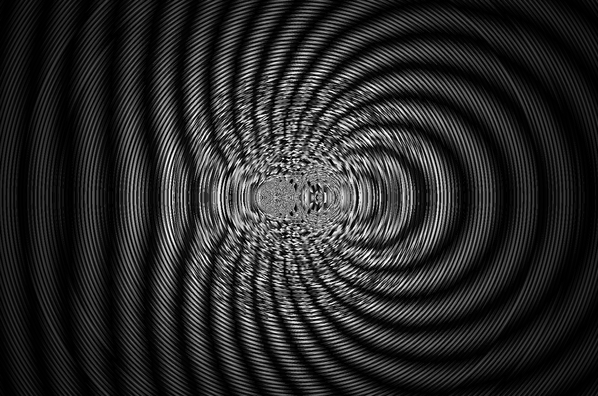

# Описание
Данная программа позволяет симулировать волновые процессы.

Пример двух источников с близкими частотами:

Поскольку программа реализованна на целочисленной арифметики, 
значение фазы вычисляется с большой ошибкой при малых расстояниях до источника.