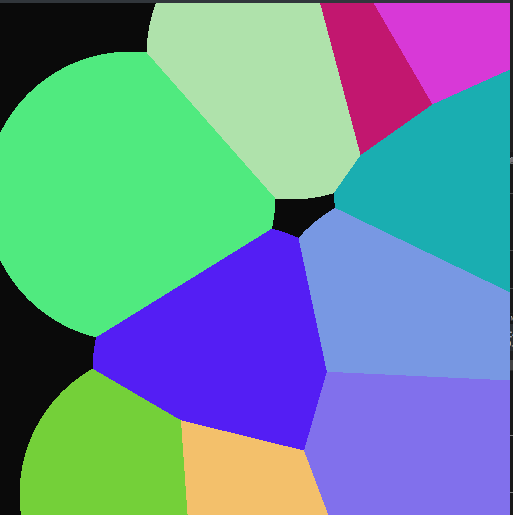

# Описание
Данная программа реализует динамическую диаграму Вороного. 

Пример:


Количество точек и скорость роста задаются через `define`.

## Запуск
Должна быть установлена бибилотека SDL

Сборка:
```
mkdir build
cd build
cmake ..
make
```

Запуск программы:
```
./Voronoi
```

Создание файла с IR:
```
make install
```

## Получение llvm IR
